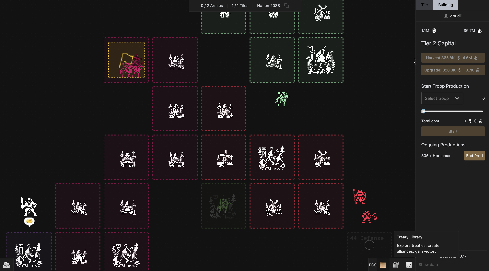

# Treaty V0 Vault

Treaty is a fully on-chain 4X strategy game. In Treaty, players are able to express and enforce social contracts (i.e. treaties) through code.

Vault contains shared code between contracts, indexer, and frontend. Contracts can be found in [this repo](https://github.com/curio-research/treaty-contracts).

